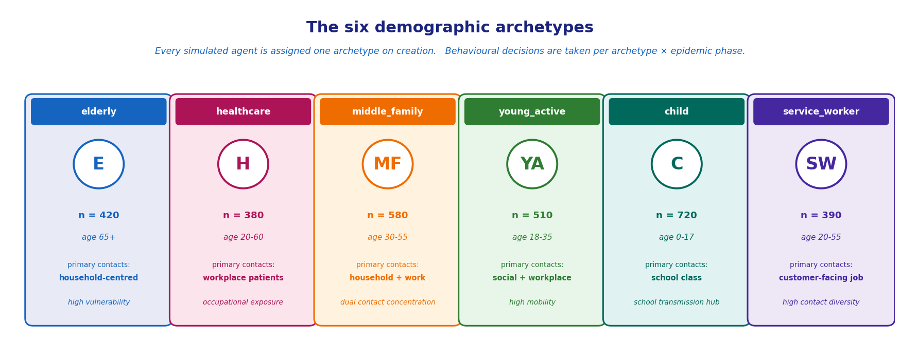
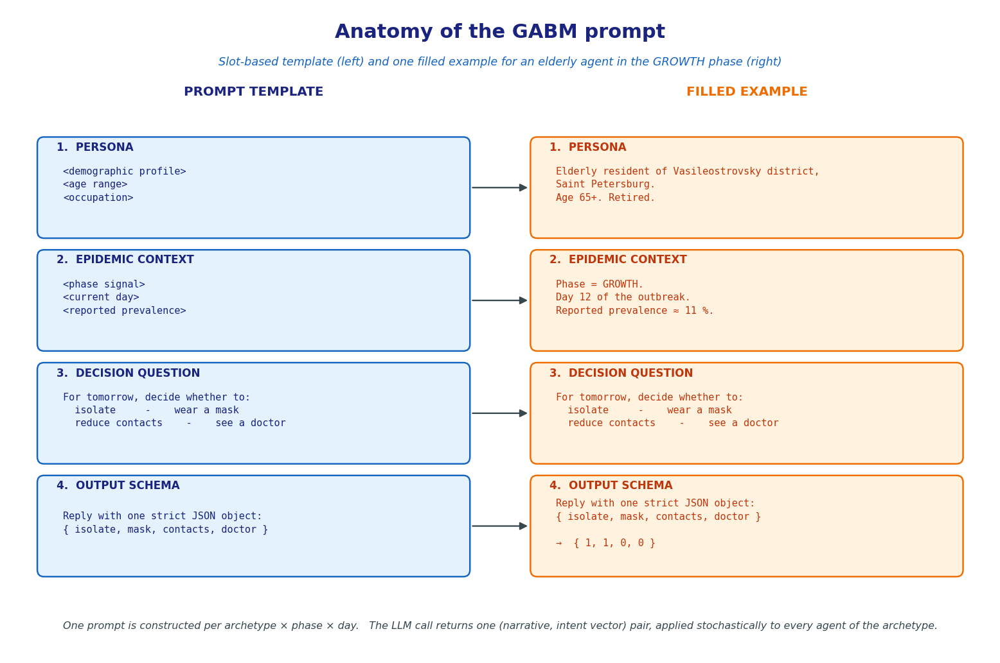
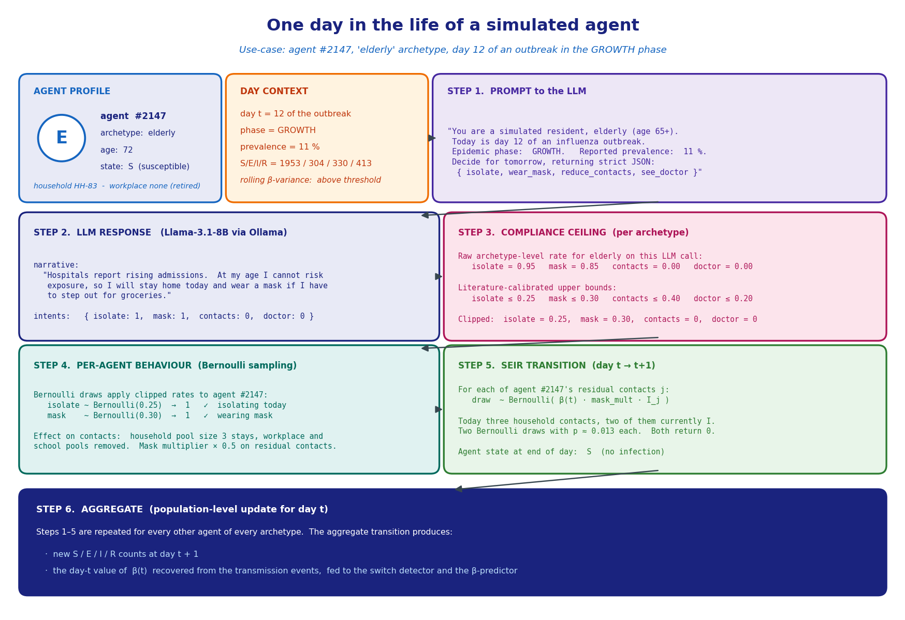

# Architecture

This document describes the pipeline stages and how the modules in `src/` fit together.

## Pipeline overview

```
+-------------------+        +---------------+        +-------------+
| synthetic         |        | GABM          |        | switch-day  |
| population (data) | -----> | behavioural   | -----> | detector    |
| households.txt    |        | layer (LLM)   |        |             |
+-------------------+        +---------------+        +------+------+
                                                             |
                                                             v
                                                      +------+------+
                                                      | beta-       |
                                                      | prediction  |
                                                      | (11 methods)|
                                                      +------+------+
                                                             |
                                                             v
                                                      +------+------+
                                                      | SEIR tail   |
                                                      | (compart.)  |
                                                      +------+------+
                                                             |
                                                             v
                                                      I(t) on horizon h
```

The pipeline is hybrid: an agent layer simulates behaviour during the early outbreak, a switch detector decides when the behavioural layer is no longer informative, and a compartmental SEIR tail carries the forecast forward to the requested horizon.

## Modules in `src/`

### `agents/` (GABM behavioural layer)

- `base.py`: `Agent` dataclass (state, archetype, household, demographics) and the per-day step routine.
- `archetypes.py`: six demographic archetypes (elderly, healthcare, middle_family, young_active, child, service_worker) with compliance ceilings and prompt-priming additions.
- `prompts.py`: phase-aware prompt template (BASELINE / GROWTH / PEAK / DECLINE).
- `backends/`: LLM backend adapters. Each adapter exposes the same interface and only differs in transport:
  - `ollama.py`: local Llama-3.1-8B via Ollama
  - `openrouter.py`: eight cloud models via OpenRouter (free tier)
  - `gpt4.py`, `gemini.py`, `qwen.py`, `llama.py`: direct provider clients

A simulation day issues one prompt per archetype, parses a JSON `{isolate, mask, contacts, doctor}` envelope, applies the compliance ceiling, and clips out-of-range values. Per-agent intents are sampled from the clipped archetype rates.

The six archetypes:



Each prompt has four slots: persona, epidemic context, decision question, output schema. The figure below shows the template (left) and one filled example for an elderly agent in the GROWTH phase (right):



End-to-end view of a single agent on a single day, from the LLM call to the SEIR transition:



### `regime/` (switch-day detection)

- `threshold.py`: rolling-variance threshold detector on the empirical beta trace.
- `hmm_detector.py`: three-state HMM (`hmmlearn`) as a secondary detector.
- `relative_rt_detector.py`: Rt-based heuristic.
- `combined_detector.py`: voting wrapper over the three detectors.
- `base.py`: common detector interface; each detector returns either a switch day or `None`.

### `calibration/` (beta-prediction methods and ABC variants)

- `beta_prediction.py`: eleven beta-extrapolation methods grouped into three families:
  - constant baselines (6): mean of the last `k` observed beta values, regression-day, last-day, etc.
  - trend extrapolators (3): linear, exponential, regression-day extrapolation.
  - sequence-aware learners (2): LSTM, MLP trained on simulated beta traces.
- `abc.py`: three approximate Bayesian computation variants: rejection, sequential Monte Carlo (SMC), annealing.
- `history_matching.py`: history-matching loop used by the experiment runners.
- `pipeline.py`: combined calibrate-then-forecast driver.

### `models/` (simulators and SEIR submodel)

- `abm.py`: rule-based ABM baseline (no LLM).
- `gabm.py`: generative ABM driven by the agent layer.
- `hybrid.py`: hybrid GABM-then-SEIR simulator. Hands off to the SEIR tail on the detected switch day.
- `seir.py`: discrete-time SEIR step; integrates forward from the agent-layer end state using a beta trajectory supplied by `calibration/`.
- `data_structures.py`: typed containers for population, day records, beta traces, switch points.

### `orchestrator/` (end-to-end driver)

- `orchestrator.py`: top-level entry. Loads config, builds the population, runs the agent layer, calls the detector, calls the beta predictor, runs the SEIR tail, writes results. Used by the runners in `scripts/` and `experiments/`.

### `uncertainty/` (bootstrap confidence intervals)

- `bootstrap.py`: hierarchical cluster bootstrap (B=1000) used for cross-model peak-height intervals and paired Wilcoxon comparisons reported in the thesis.

### `utils/` (data loaders and small helpers)

- `data_loader.py`: synthetic-population loader (tab-separated; one row per agent with `sp_id`, lat/lon, demographics).

### `visualization/` (geo-map rendering and dashboard)

- `dashboard.py`: Streamlit app entry point (see `STREAMLIT.md`).
- `map_component.py`: folium-based city map renderer.
- `agent_inspector.py`: per-agent diary panel.

### `logging/` (run-log infrastructure)

Run-log helpers used by every entry point. Writes per-day JSONL records to `data/results/<run-id>/`.

## Configuration entry point

All entry points consume YAML configs from `config/` (see `CONFIG.md`). Four pre-registered cells form the controlled four-configuration ablation:

| File | Compliance ceiling | Prompt add-ons |
|---|---|---|
| `default.yaml`              | on  | on  |
| `no_ceilings.yaml`          | off | on  |
| `no_addons.yaml`            | on  | off |
| `no_ceilings_no_addons.yaml`| off | off |

## Module dependency graph

```
orchestrator/
   |
   +--> models/hybrid.py
   |       +--> models/gabm.py  --> agents/  --> agents/backends/
   |       +--> regime/         (switch detector)
   |       +--> calibration/    (beta predictor)
   |       +--> models/seir.py  (SEIR tail)
   |
   +--> utils/data_loader.py    (synthetic population)
   +--> uncertainty/bootstrap.py (post-hoc CIs)
   +--> logging/                (run records)
```

Only the orchestrator imports across all submodules. The submodules themselves are loosely coupled: for example, `regime/` does not know about `agents/`, and `calibration/` does not know about the SEIR tail; both consume and return beta traces.
