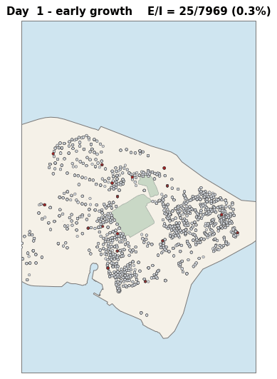

# Visualisation dashboard

The release ships a Streamlit dashboard at `app/dashboard.py`. It loads results written by any pipeline run and renders three views.



1. City map: per-day agent positions on the district polygon, coloured by S/E/I/R state.
2. Agent inspector: diary panel for one agent: its archetype, household, daily prompt, LLM response, clipped intent, Bernoulli draw, and next-day state.
3. SEIR forecast overlay: predicted I(t) curve on the simulation horizon, with the bootstrap CI band.

## Launching

```bash
streamlit run app/dashboard.py
```

The dashboard opens at `http://localhost:8501`.

## Pointing it at a run

By default the dashboard scans `data/results/` for run directories and lists them in the sidebar. Pick a run; the map and inspector populate from its `snapshots/` and `logs/` subdirectories.

To point at a non-default results directory:

```bash
streamlit run app/dashboard.py -- --results-dir /path/to/runs
```

## What you can do in the dashboard

- Use the day slider to scrub through the outbreak.
- Click an agent marker on the map to load that agent into the inspector.
- The inspector exposes the per-day prompt and response from the LLM backend, the clipped intent vector, and the resulting state transition.
- The forecast overlay reads the bootstrap CI from `metrics.json` of the active run.

## Required files in `data/results/<run-id>/`

The dashboard expects the standard run layout (see `DATA.md`):

```
<run-id>/
  metrics.json
  snapshots/day_*.json
  logs/prompts.jsonl
  logs/responses.jsonl
```

If any of these are missing, the dashboard hides the corresponding view.

## Geo file

The map view reads a GeoJSON polygon from the path set by `data.geo_file` in the active config. The release does not bundle one; supply your own district polygon as described in `DATA.md`.
